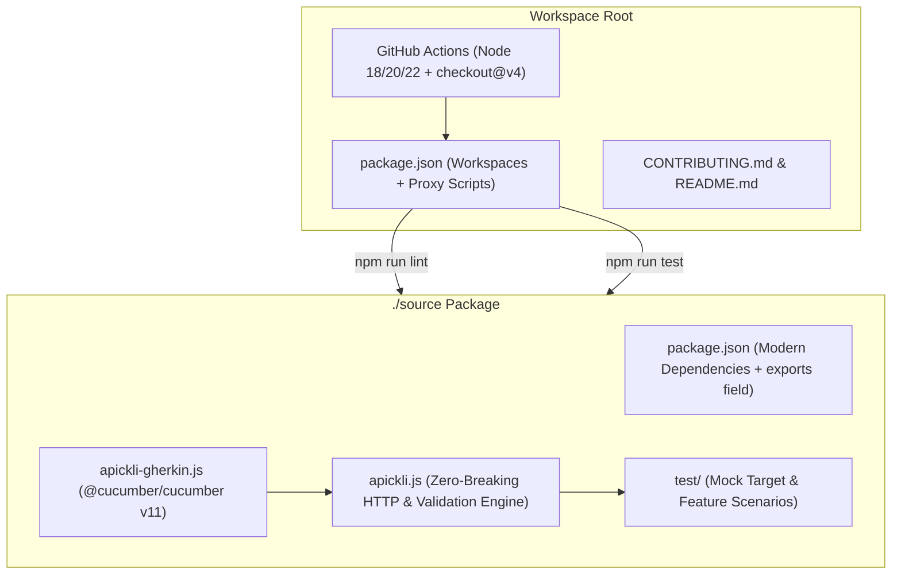

# Technical Specification: Full Stack Modernization & Workspace Delegation

## 1. Problem Statement & Root Cause

- **Background**: `apickli` is a REST API integration testing framework built on top of `cucumber.js`. Over years of repository inactivity, its underlying stack has fallen behind modern Node.js standards. Because `apickli` is widely used in enterprise CI/CD pipelines, modernizing the stack requires zero breaking changes to public APIs and Gherkin step expressions.
- **Root Causes & Modernization Gaps**:
  1. **Root Workspace & Script Deficit**: Root `package.json` is currently empty `{}`. Standard `npm test` or `npm run lint` commands executed at the root fail.
  2. **Deprecated HTTP Engine (`request`)**: Core HTTP execution in `apickli.js` relies on `request` (v2.x), which was deprecated in 2020.
  3. **Outdated Dependencies & Validation Engines**: `is-my-json-valid` and `swagger-tools` are unmaintained; XML/XPath dependencies use legacy versions.
  4. **Outdated GitHub Actions Workflow**: `.github/workflows/main.yaml` uses deprecated `actions/checkout@v2` without explicit Node.js version matrix testing.
  5. **Documentation Drift**: `CONTRIBUTING.md` still instructs developers to run `gulp test` and `gulp jshint`.

---

## 2. Proposed Architectural Approach

1. **Workspace & Root Script Delegation**:
   - Configure root `package.json` with npm workspaces (`"workspaces": ["source"]`) and top-level delegation scripts (`lint`, `test`, `ci`).
   - Define package `exports` in `source/package.json` (`apickli` and `apickli/apickli-gherkin`).

2. **HTTP Engine & Dependency Modernization**:
   - Replace/refactor deprecated HTTP client implementations while preserving 100% backward compatibility for all `Apickli` instance properties (`this.headers`, `this.cookies`, `this.queryParameters`, `this.formParameters`, `this.httpRequestOptions`, `this.clientTLSConfig`) and methods.
   - Upgrade validation engines (JSON Schema, XML/XPath, JSONPath) to modern, actively maintained libraries (`ajv`, `@xmldom/xmldom`, `@xmldom/xpath`, `jsonpath-plus`).

3. **CI Matrix & Developer Workflow Modernization**:
   - Update `.github/workflows/main.yaml` to use `actions/checkout@v4` and `actions/setup-node@v4` with a Node.js matrix (18.x, 20.x, 22.x).
   - Ensure clean execution in both sandboxed local environments and multi-version CI.

4. **Documentation & Style Standardization**:
   - Update `CONTRIBUTING.md` and `README.md` to reflect modern Node.js standards, ESLint v8+ compliance, and Cucumber v11 hooks.

---

## 3. Scope & File Touchpoints

### Target Files to Modify
- **[`package.json`](file:///Users/omidt/apickli/package.json)**: Add root delegation scripts (`lint`, `test`, `ci`) and workspace configuration.
- **[`source/package.json`](file:///Users/omidt/apickli/source/package.json)**: Modernize dependency specifications, scripts, and package `exports`.
- **[`source/apickli/apickli.js`](file:///Users/omidt/apickli/source/apickli/apickli.js)**: Modernize HTTP request handling, JSON Schema, and XML/XPath evaluation while strictly preserving public contract signatures and behavior.
- **[`source/apickli/apickli-gherkin.js`](file:///Users/omidt/apickli/source/apickli/apickli-gherkin.js)**: Ensure step definitions strictly adhere to `@cucumber/cucumber` v11 standards.
- **[`CONTRIBUTING.md`](file:///Users/omidt/apickli/CONTRIBUTING.md)**: Overhaul to document modern npm workflows, ESLint, and Cucumber scenarios.
- **[`README.md`](file:///Users/omidt/apickli/README.md)**: Update code examples and dependency setup notes.
- **[`.github/workflows/main.yaml`](file:///Users/omidt/apickli/.github/workflows/main.yaml)**: Upgrade to `actions/checkout@v4` and add Node.js matrix testing.

---

## 4. Edge Cases & Safety Constraints

- **CI & Downstream Pipeline Safety**: Public API `apickli.Apickli` and all Gherkin step expressions must retain exact parameter contracts and error structures.
- **Mutual TLS & Custom Headers**: Client TLS configuration (`valid.key`, `valid.cert`, `valid.ca`) and custom header/cookie setting must function identically across all supported Node versions.
- **Nullish & Empty Handling**: Handle empty scenario table variables and undefined replacements gracefully.

---

## 5. Acceptance Criteria

- [ ] `npm run lint` from workspace root succeeds cleanly with zero ESLint errors across all source files.
- [ ] `npm run test` from workspace root launches mock server and passes all Cucumber `@core` scenarios.
- [ ] `npm run ci` runs installation, linting, and testing seamlessly.
- [ ] GitHub Actions workflow tests on Node.js 18.x, 20.x, and 22.x using `actions/checkout@v4`.
- [ ] `CONTRIBUTING.md` and `README.md` strictly accurately document modern NPM, ESLint, and Cucumber standards.
- [ ] 100% backward compatibility maintained for all public methods, properties, and Gherkin step bindings.
